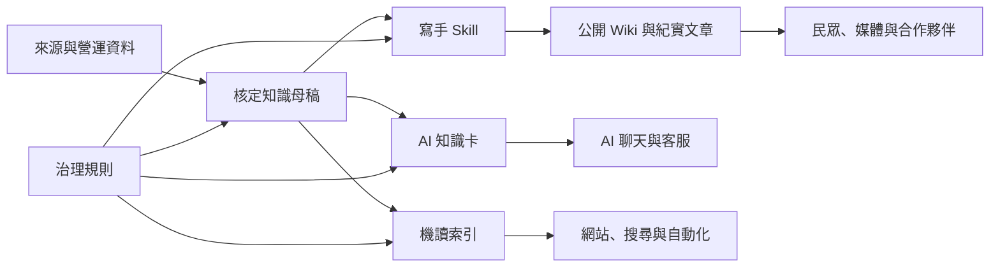

# 人讀、治理與機讀內容如何分層

## 核心決策

同一項事實只維護一組核定口徑，但依用途產生不同呈現。一般讀者不需要閱讀來源登錄與狀態欄位；AI 也不能只讀敘事文章後自行推論正式答案。

文字替代說明：來源先形成核定知識母稿；寫手 skill 將母稿轉成公開文章，AI 使用核定知識卡，網站與工具使用機讀索引。治理規則同時約束三種輸出，任何輸出都不能反向創造新事實。

## 四層責任

| 層次 | 位置 | 主要讀者 | 可以做什麼 | 不可以做什麼 |
|---|---|---|---|---|
| 公開人讀 | `docs/public/` | 民眾、媒體、教師、合作夥伴 | 用 Wiki、問答或紀實敘事說明核定內容 | 省略關鍵限制、創造新數字或冒充即時公告 |
| 知識母稿 | `docs/about/`、`services/`、`impact/`、`stories/` | 編輯者、訓練者、Owner | 保存完整口徑、適用條件與跨主題脈絡 | 為追求好讀而刪除證據邊界 |
| 治理與來源 | `docs/governance/`、`sources/`、`ai/` | 維護者、稽核者、AI 設計者 | 管理狀態、權責、來源、個資與引用規則 | 成為一般讀者唯一入口 |
| 機讀 | `registry/` | AI、網站、搜尋與自動化 | 提供穩定 ID、狀態、來源、限制與版本 | 直接保存個資或讓未核定內容成為正式答案 |

## 發布規則

1. 新事實先進入來源登錄與知識母稿，不直接寫進公開文章。
2. 寫手 skill 只從 `approved` 母稿建立公開文章；若使用 `review` 資料，成品不得高於 `review`。
3. 公開文章必須記錄 `canonical_knowledge_ids`，並在文末提供簡短資料依據與當期查詢邊界。
4. AI 預設回答只使用 `approved` 知識卡；公開文章可改善語氣，但不能取代知識卡限制。
5. 事實變更時先更新母稿與卡片，再找出所有衍生文章同步或撤回。

## 例外與風險

- 當期服務、勸募、聯絡方式與法定公告可能比 Release 更快變動，須即時回查官網或正式文件。
- 敘事文章可能為了流暢合併時間段；不得因此暗示事件有未被來源支持的因果關係。
- 同一內容若在 Notion、Repo 與官網分別人工改寫，仍可能漂移；應保留知識 ID 與 Release 版本。
- `docs/public/` 公開不代表其中連結或提及的第三方照片、影音、Logo 與人物素材已取得再利用授權。

## 維運注意事項

- 每次 Release 產生「已核定母稿、知識卡、公開文章」三份變更清單。
- 服務與聯絡資訊至少每 90 天審視；歷史與一般文章至少每 180 天審視。
- AI 或網站引用時回傳知識卡 ID、Repo 版本與查閱日期；遇到個案、費用、授權、稅務或時程則轉人工確認。
