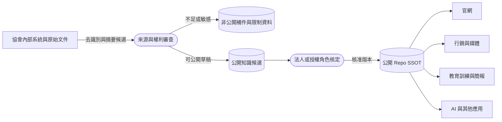

# 哪些資料可以放進公開 Repo

## 公開 Repo 可以承載

- 核定的法人介紹、使命、歷史與服務說明。
- 公開申請、捐贈、志工及合作入口。
- 具備定義、來源與核定紀錄的成果數據。
- 已取得使用權的故事、照片、引言與合作描述。
- 不含個資與內部控制細節的教育訓練素材。
- 公開年度報告、政策、方法與更正紀錄。

## 不得放進公開 Repo

- 受贈者、捐贈者、志工與合作窗口的個人資料。
- 兒少姓名、住址、個案紀錄、家庭處境或可識別影像。學校、課輔與照護單位名稱可公開，但不得因此揭露個人身分。
- 設備序號、資產編號、物流明細與資料清除紀錄。
- 內部財務憑證、銀行資訊、合約、會議限制文件。
- 帳號、密碼、權杖、金鑰、系統弱點與內部權限資料。
- 未授權照片、Logo、影音、新聞全文或第三方教材。過往合作可引用單位名稱；現有合作使用 Logo 時須取得合作方正式檔案與規範。

## 資料流程圖與信任邊界

本資料流程圖說明內部原始資料如何經去識別、來源、權利及法人核定後，成為可供外部應用引用的公開知識。

文字替代說明：原始營運資料先在協會控制範圍內完成去識別、來源與權利審查；敏感資料留在非公開系統。只有核准的公開版本才能進入 Repo，再由官網、行銷、教材、簡報與 AI 引用。

## 維運注意事項

公開內容遭更正或撤回時，必須追蹤所有下游載體；只修改 Repo 而未同步網站與簡報，仍會留下過時資訊。
