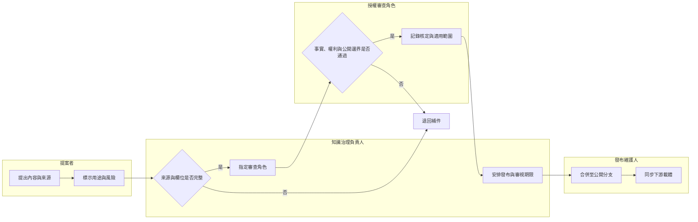

# 公開內容如何從提案走到發布

## 情境＋角色作業流程圖

本圖呈現提案者、知識治理負責人、授權審查角色及發布維護人之間的公開內容核定流程。

文字替代說明：提案者提供內容、來源、用途與風險。知識治理負責人檢查完整性並指派適當審查人；未通過者退回補件。核准後由發布維護人合併至公開分支，並同步官網、簡報、行銷或教材。

## 狀態

- `draft`：資料尚未完整。
- `review`：已具來源，等待指定角色核定。
- `blocked`：有法遵、個資、權利或證據問題，不得發布。
- `approved`：已核定，可在適用範圍內公開。
- `superseded`：已有新版取代，保留歷史追溯但不再引用。
- `withdrawn`：因錯誤、權利撤回或政策變更停止使用。

## 完成標誌

內容已合併、下游載體已同步、核定證據可追溯，且設定下次審視日期。
