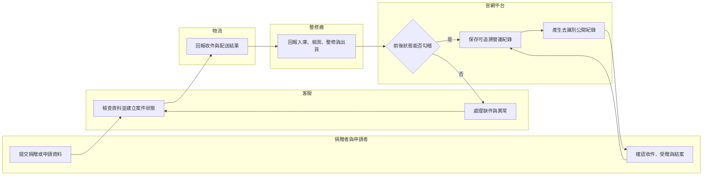
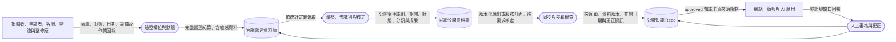

# 官網資料如何成為可信任來源並供 AI 引用

## 結論

綠色奇蹟以 2018 年官網大改版作為營運資料追溯分界：

- **2018 年以前**：歷史服務已存在，但 Excel（試算表）、紙本及舊系統明細未必完整，也不再以全面補齊或移轉為目標。歷程可使用新聞、政府、合作方及協會公開資料佐證，不要求每一事件都有逐筆台帳。
- **2018 年以後**：官網線上流程持續累積申請、捐贈、整修、物流、交付及結案紀錄。各角色分段填寫與回報，經系統勾稽後形成可追溯的營運資料；公開紀錄可作為知識庫的可信任來源。
- **新版官網改版期間**：尚未核定如何將公開資料穩定提供給本 Repo 與 AI。現階段只建立治理與需求輸入，不宣稱已有 API（應用程式介面）、自動同步或即時資料供應。

可信任代表資料具有來源、角色、狀態、時間及更正軌跡，可以追溯；不代表資料永遠不會填錯，也不代表所有資料均可公開。

## 資料年代與使用政策

| 資料時期 | 主要載體 | 證據用途 | 使用限制 | 本 Repo 政策 |
|---|---|---|---|---|
| 2004–2017 歷史期 | 舊網站、Excel、紙本、新聞、政府與合作方公開資料 | 證明服務起源、能力演進、重要合作與代表案例 | 明細可能遺失，當時需求、欄位與今日定義不同，不適合直接比較 | 不再全面補造明細；以公開史料及 Owner 核定脈絡敘事 |
| 2018–現在 可追溯營運期 | `reuse.org.tw` 後台資料庫與公開紀錄 | 申請、捐贈、回收、整修、物流、交付、結案與成果統計 | 需區分申請量、完成量、產能、轉介量及公開範圍 | 作為營運成果主要來源；引用時保留資料版本、統計定義與查閱日期 |
| 新版官網改版期 | 新舊流程並行或逐步替換 | 建立未來資料供應與 AI 應用 | 功能、資料結構與同步方式尚未核定 | 先產出需求候選；不得在知識庫預先定義工程契約 |

## 現行角色如何完成資料勾稽

本圖說明目前資料可信度來自多角色分段回報，而不是單一人員事後彙整。實際角色名稱、狀態及權限仍須在官網需求分析時核對。

主要路徑是由捐贈者或申請者開始，客服檢查後交給物流與整修廠分段回報，平台檢查狀態是否可勾稽。缺件或矛盾回到客服處理；完成交付與結案後，才形成可追溯紀錄。未來需求須明確定義何者才算「完成回收」「完成整修」「完成交付」與「完成結案」。

## 營運資料如何流向公開知識與 AI

本圖分開呈現內部資料、公開資料及未來 AI 整合的信任邊界。正式資料庫包含個資與作業明細，不應直接流入公開 Repo 或 AI。

資料權威依序為官網營運資料庫、經核定的官網公開資料集，以及保留版本與來源的知識 Repo。個資、地址、弱勢證明、設備序號、內部備註及權限紀錄不得流入公開資料集。AI 只讀取 `approved` 的知識與公開資料，不直接連正式資料庫執行查詢或寫入。

## 歷史資料不再補齊的邊界

### 已核定

- 不以補齊 2004–2017 逐筆 Excel、紙本或舊系統資料作為歷史發布 Gate。
- 不因缺少逐筆名冊，就否定已由公開新聞、政府、合作方或 Owner 親歷核定支持的服務歷程。
- 不把後來建立的欄位、狀態或統計定義套回舊資料，製造不真實的精確度。
- 若舊資料因法定保存、會計、稽核、爭議處理或特別研究需要而存在，採個案調閱；不預設全部搬入新官網或公開 Repo。

### 仍然禁止

- 不得把新聞報導的申請量寫成完成交付量。
- 不得將不同合作體系、期間或設備類型直接加總成累計成果。
- 不得因資料庫自 2018 年後較完整，就推論 2018 年以前沒有服務或成果。
- 不得把公開資料「可信任」解讀成可公開個資、原始附件或內部作業明細。

## 新版官網資料供應需求候選

本節是 EXP（探索）／REQ（需求）輸入，不是已核定功能、資料結構或工程方案。

### P0：先建立可信資料出口

| 需求候選 | 目的 | 邊界與例外 | 完成判斷候選 |
|---|---|---|---|
| 公開資料目錄 | 讓人與 AI 知道有哪些可引用資料 | 不列出內部資料表或敏感欄位 | 每一資料集都有名稱、Owner、期間、更新頻率與公開等級 |
| 穩定公開識別 | 讓 Repo 可追溯同一案件、專案或結案紀錄 | 不使用身分證、電話、地址或設備序號作公開鍵 | 公開頁與匯出資料可用同一識別互相核對 |
| 統計定義與狀態字典 | 區分申請、受理、入庫、整修、交付、結案及取消 | 舊資料無法套用時標示 `historical-undefined` | 每一指標可找到分子、分母、期間、排除與去重方式 |
| 版本化公開匯出 | 供 Repo 依版本讀入，不因頁面改版失去追溯 | 初期可採 JSON／CSV，不預設必須即時 API | 匯出包含資料版本、產生時間、來源網址與資料筆數 |
| 更正與撤回紀錄 | 防止 AI 長期引用已修正內容 | 不在更正紀錄揭露受保護資料 | 可判斷新增、修正、撤回及生效時間 |

### P1：建立 Repo 與 AI 同步治理

- 以排程或人工核定方式讀取官網公開匯出，先比對差異，再更新 Repo。
- 每次同步記錄來源版本、資料期間、筆數、增刪修摘要、執行結果與核定者。
- 統計資料與敘事知識分開：官網供營運事實，Repo 管理定義、背景、限制、故事及 AI 回答規則。
- 發現異常時停止提升為 `approved`，保留上一版並通知資料 Owner。
- AI 回答須回傳資料期間、來源 ID 或公開連結；不能只回一個沒有時間範圍的數字。

### P2：用 AI 放大服務與影響力

- 協助申請者檢查缺件並解釋流程，但資格核定仍由人員負責。
- 從回收、整修、物流與保固紀錄找出等待、重工、低良率及高故障原因。
- 自動產生年度成果草稿、合作摘要及教育素材，但重大數字與個案故事發布前仍須人工核定。
- 讓合作夥伴依公開規則查詢專案進度與成果，降低客服重複回覆。
- 建立錯誤回報與知識回寫，使官網流程改善與 Repo 知識更新形成閉環。

## 風險與維運注意事項

| 風險 | 控制方向 |
|---|---|
| 新舊系統統計口徑改變 | 保留資料版本、狀態對照及切換日期，不靜默合併 |
| 個資或弱勢資料外洩 | 採最小公開欄位、去識別、權限分離及輸出檢查 |
| AI 引用過期資料 | 每筆公開資料附版本與產生時間；超過審視期限時提示需更新 |
| 資料更正後 Repo 未同步 | 提供差異清單、更正事件及同步狀態 |
| 自動化放大原始填寫錯誤 | 在匯出前完成狀態與欄位驗證，重大成果仍需人工覆核 |
| 需求文件反向限制工程 | 本頁只描述目的、規則、資料責任與驗收候選；API、資料模型、架構及工期由後續 REQ／ENG 評估 |

## 交付 Gate

- `D0 權威`：2018 年後官網資料庫為營運追溯來源，由 Chinwen 核定；通過。
- `D5 資料`：公開欄位、去識別規則、版本、更正與保存責任尚待需求分析；`pending`。
- `D8 人工審查`：客服、整修、物流、會計／勸募、個資及技術角色尚未具名審查；`pending`。
- `D9 交接`：本頁可作未來 EXP／REQ 輸入，但尚未形成正式需求、API 或工程工作；`reference-only`。

## 完成標誌

未來當官網能輸出具版本、期間、統計定義、公開識別、更正狀態及來源連結的去識別資料，Repo 能在人工核定後同步並供 AI 附來源引用，才算完成官網到知識庫的可信資料閉環。
