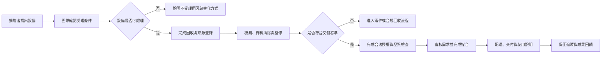

# 再生電腦如何完成公益服務閉環

## 適用範圍

本頁說明對外可理解的服務模型，不取代內部設備處理、資料清除、申請審查、物流、保固或個案管理 SOP（標準作業程序）。

## 情境＋角色作業流程圖

本圖用來說明設備捐贈者、綠色奇蹟服務團隊、整修作業與受贈媒合之間的主要交接。實際角色名稱與責任仍待方案負責人核定。

文字替代說明：捐贈設備先確認受理條件；可處理設備才進入回收登錄、資料清除、整修與品質檢查。不合格設備轉入零件或合規回收。合格設備完成授權後，依核定需求媒合、交付並追蹤。

## 例外與風險

- 設備規格、地區、數量、物流及危險狀態可能造成不受理。
- 資料清除方法與證明範圍必須由實際作業負責人核定。
- 申請不代表一定受贈；供需、資格及等待期需要現行規則。
- 保固期間、範圍、排除條件及維修方式尚待核對。

## 完成標誌

只有設備處理、需求審核、交付紀錄及後續責任均可追蹤，才算服務閉環完成。

## HTML 雛型

prototype（HTML 雛型）不適用。本 Repo 是公開知識與教育訓練來源，目前不建立系統操作畫面；未來如有官網或服務平台雛型，應在對應網站／產品 Repo 使用模擬資料管理。
