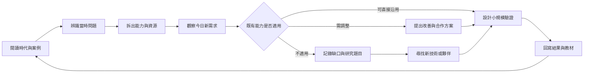

# 如何用二十年經驗解決下一個問題

## 這份教材的目的

歷史記事不是為了把每個日期考證到最細，而是保存組織曾經面對的問題、採取的做法、累積的能力及尚未解決的限制。新進人員應從案例理解綠色奇蹟擁有的資源與合作方法，並把經驗轉化為下一個服務改善或研究題目。

## 三個數位世代，三次需求轉變

| 時代 | 社會與科技條件 | 主要需求 | 綠色奇蹟的回應 | 留下的能力 |
|---|---|---|---|---|
| 網路成長世代（2000 年代） | PC 與寬頻快速進入家庭，但設備、連線與使用機會仍不平均 | 取得可用電腦、合法軟體及基本網路入口 | 建立線上回收、物流、申請、論壇與合法授權流程 | 把分散的捐贈、設備、物流與需求搬到網路上協調 |
| 行動與平台世代（2010 年代） | 手機普及，服務期待即時、容易參與，企業公益與社群協作增加 | 讓個人、企業與公益單位更容易參與，並追蹤設備去向與服務責任 | 行動版服務、跨單位 SOP、企業媒合、扶輪與社群合作 | 跨組織協調、設備追蹤、服務閉環與對外溝通 |
| 遠距與 AI 世代（2020 年代至今） | 遠距學習、雲端工具及 AI 應用提高設備效能、連線、素養與資料安全門檻 | 不只要有電腦，還要能穩定上課、使用軟體、保護資料並跟上新工具 | 疫情支援、法人化、擴大整修能力、合法授權、需求轉介與知識治理 | 從「交付設備」走向「持續可用、可學習、可維護、可追溯」 |

## 環境價值如何演進

| 階段 | 當時常用觀念 | 今天可以延伸的理解 |
|---|---|---|
| 減少廢棄 | 不讓仍可用的電腦成為電子廢棄物、污染土地 | 建立資料清除、分類、零件利用與合規去化責任 |
| 惜物與延役 | 能修就修，讓設備多服務一段時間 | 以品質、合法軟體、保固與維修確保「延役」真的成立 |
| 再利用與循環 | 讓汰換設備回到使用循環 | 同時設計回收端、整修端、需求端、物流與再次回收 |
| 減碳與永續 | 延後購買新設備可能減少製造與供應鏈負擔 | 用可重算的方法、實際交付台帳及清楚邊界呈現估算，不把倡議寫成認證 |

## 從案例萃取能力

| 案例 | 當時問題 | 可重用能力 | 面對新問題時的提問 |
|---|---|---|---|
| 2006–2008 線上回收、申請與論壇 | 供給與需求分散，人工協調成本高 | 表單、物流、媒合、社群動員 | 今天能否用自動化與 AI 降低申請、分類及追蹤成本？ |
| 八八風災後電腦教室支援 | 災後多地、多校同時需要恢復設備 | 快速盤點、分區協作、整修與交付 | 面對颱風、地震或突發停課，是否已有可啟動的應變服務包？ |
| 疫情遠距學習支援 | 家庭同時缺設備、網路、軟體與使用協助 | 需求轉介、夥伴募集、整修、正版軟體與家庭交付 | 下一次數位落差是否來自 AI 設備效能、付費工具或使用能力？ |
| 慈濟、扶輪、企業與 DOC 合作 | 單一組織產能不足以涵蓋需求 | 判斷自己做、共同做或轉介；建立合作邊界 | 是否能快速辨識最合適的設備、經費、整修、通路與服務夥伴？ |
| 獨立法人與公開知識庫 | 經驗分散在人、文件與網站中 | 治理、公開口徑、教材與可追溯知識 | 新人能否不用依賴單一資深成員，就理解過去決策並繼續改善？ |

## 新進人員的學習循環

本圖說明如何把歷史案例轉為新的服務提案。它不是工程流程，也不表示所有提案都會執行。

文字替代說明：先從案例辨識問題，再拆出可用能力與資源，對照今天的需求。可沿用的能力進入小規模驗證；不足之處形成改善方案或研究題目。驗證結果必須回寫知識庫，讓下一位成員從更新後的經驗繼續前進。

## 理事長訪談如何補充這套方法

[2025 年理事長訪談素材](../stories/chair-interview-2025.md)把二十年經驗濃縮成幾個判斷：先確認人的處境是否改善，再談速度與成本；用標準化和自動化把時間留給人；量化是研究工具，不是追求台數；真正值得傳承的是經驗、方法與能解決未來問題的年輕人。

## 新人完成標誌

新進人員完成本教材後，應能：

1. 說明網路、行動與 AI 世代的電腦需求差異。
2. 說明惜物、減廢、再利用、循環與減碳之間的演進關係。
3. 從一個歷史案例指出問題、角色、資源、限制與可重用能力。
4. 面對新需求時，判斷應由綠色奇蹟自行執行、與夥伴共同執行或轉介。
5. 提出一個可驗證的改善題目，並把結果回寫知識庫。

## 建議實作練習

選擇一個目前問題，例如 AI 學習設備不足、老舊電腦無法支援新軟體、災後快速復原或偏鄉數位陪伴，完成一頁提案：

- 問題與受影響對象。
- 可引用的歷史案例。
- 已有能力、資源與合作夥伴。
- 尚缺能力與風險。
- 四到八週可完成的最小驗證。
- 成果如何記錄並回饋下一次服務。

## 邊界與風險

- 歷史案例提供判斷參考，不代表舊方法可原樣套用。
- AI 應用涉及設備效能、帳號、資料、授權、內容正確性及使用素養，須另外評估。
- 減碳是方法約束下的估算，不能用故事推導成果數字。
- 個人與兒少資料不得為了教材完整而公開。
- 教材中的合作模式是能力範例，不取代現行合作方的正式同意與分工。
