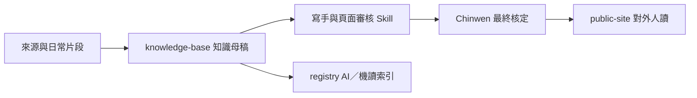

# 綠色奇蹟知識工作台

這裡保存治理化知識母稿、來源脈絡、教育訓練與 AI 維護說明。資料可以從公開 Repo 查閱，但不屬於對外網站的閱讀體驗，也不由 `mkdocs.yml` 發布。

## 依工作任務進入

- 核對歷史與組織：從「法人定位與歷史關係」及「成立緣由與時序記事」開始。
- 整理服務與 QA：從「再生電腦服務閉環」及「服務品質系統」開始。
- 建立成果或議題內容：從「成果與影響力衡量」開始，先核對期間、狀態及去重。
- 培訓新進人員：使用「教育與傳承」內容，不把內部教材直接當成對外文章。
- 生成對外文章：讀取核定母稿後使用寫手與公開頁面審核 SKILL，最後交由 Chinwen 核定。

## 與公開網站的關係

文字替代說明：來源片段先整理為知識母稿，再由寫手與審核流程產生對外文章；Chinwen 核定後才進入公開網站。AI 與系統則使用機讀索引，但不能反向創造新事實。

## 邊界

- `repository_visible: true`：檔案可在公開 GitHub Repo 查閱。
- `site_published: false`：不出現在一般讀者的公開網站或導覽。
- 真正需要保密的個資、兒少資訊、後台逐筆明細、合約與內控資料仍不得進入此 Repo。
