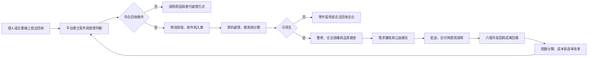

# 再生電腦服務品質系統

## 結論

綠色奇蹟的品質不是只靠「把電腦修好」，而是把免費回收、資訊追蹤、分類整修、合法授權、需求媒合、交付及六個月保固接成同一條服務鏈。平台讓資訊流先行，物流與 SOP 才能依同一案件編號運作；每次回收、故障與回饋再回寫，形成降低成本、提高良率與持續改善的循環。

## 品質政策如何逐步形成

| 年度 | 遇到的問題 | 政策改變 |
|---|---|---|
| 2005 | 申請量增加，但合作回收商未達數量不派車；回收設備也有缺件及品質不穩，使整修產出無法增加。 | 夥伴決議由服務端重新設計設備來源與物流機制。 |
| 2006 | 回收量分散，難以支持全省派車。 | 試作免費物流到府回收，將綠色奇蹟定位為面向消費者的回收服務，建立一台也可提出回收申請的機制。 |
| 2008 | 城市電子垃圾流向偏鄉的新聞引發社會疑慮，受贈者對設備品質與期待可能出現落差。 | 要求整修夥伴提高檢測品質與交付規格，並為綠色奇蹟出廠的再生電腦提供六個月免費保固。 |
| 2021 | 回收設備可能含有捐贈者資料，舊硬碟品質也會影響受贈設備可靠度。 | 再生電腦一律改用新品 SSD；舊硬碟依當時作業低階格式化後分流，品質尚可者作儲存碟或維修備品，不符合再利用規範者破壞、造冊並報廢。 |

上述為服務政策的歷史演進。現行資料清除、儲存裝置分流及可提供證明，仍以最新核定 SOP 與個案約定為準，不因歷史作法而自動等同第三方資安銷毀認證。

## 三項服務品質承諾

| 品質承諾 | 已確認口徑 | 邊界與例外 | 必留紀錄 |
|---|---|---|---|
| 免費物流回收 | 官網提供舊電腦免費到府收件／回收；一台亦可提出申請 | 不是隨到隨收；須填單、妥善包裝並配合區域與量能排程。偏遠、特殊搬運、專車或不安全設備須個案評估 | 申請編號、設備與數量、收件狀態、入庫日期、異常原因 |
| 合法再生電腦授權 | 合格再生電腦依公益資格與用途安裝合法授權的作業系統及相關軟體 | 不是所有設備、申請人或用途都自動取得授權；須符合授權方案資格、用途限制與回報要求。版本、品項與價格不得寫死 | 授權資格、設備對應、安裝／啟用、交付對象、必要回報 |
| 六個月保固 | 再生電腦自領用日起提供六個月硬體保固／免費換修 | 限非人為功能故障；耗材、個人損壞及不當使用不在內。保固期內回廠運費由受贈者負擔，個別專案另有約定時從其約定 | 設備序號、領用日、故障描述、判定、處置、完成日、重複故障 |

## 情境＋角色作業流程圖

文字替代說明：平台先建立案件並判斷受理，物流依案件收件入庫；設備經資料處理、檢測及分類後，可再生者進入整修、授權與品質檢查，不可再生者轉為零件或合法回收。合格設備通過需求審核後交付，並以六個月保固與使用回饋形成改善閉環。

## 資訊流如何降低成本、提高效率與良率

### 1. 先把需求說清楚

- 捐贈端填寫設備種類、數量、地點、故障與特殊搬運條件。
- 受贈端填寫資格、用途、使用場域、設備管理能力及可攜性需求。
- 平台在派車與整修前就排除不符情境，減少空趟、誤收與重工。

### 2. 用物流批次而不是逐件最佳化

- 免費物流成本由專案資源池統籌，不等於每一案件都有固定單價或立即派車。
- 依區域與量能合併排程，可降低平均回收成本。
- 特殊地點、搬運及偏遠案件須留異常原因，避免服務承諾失控。

### 3. 用分流與 SOP 提高良率

- 入庫即分成可整修、零件留用、其他用途或合法去化。
- 整修標準應隨安全更新、硬體相容性、零件供應及使用需求調整。
- 授權、測試及交付條件都須綁定同一設備與案件，避免機器、授權及受贈紀錄脫節。

### 4. 用保固資料推動改善

- 六個月保固不只是售後服務，也是品質回饋資料源。
- 故障原因應分類為來料、零件、組裝、軟體、運送、人為或無法重現。
- 重複故障與高故障零件應回饋到採購、留料、測試與包裝 SOP。

## 建議品質指標

下列指標先建立定義與資料來源，不預設目標值：

| 指標 | 定義 | 主要用途 |
|---|---|---|
| 收件完成率 | 已完成入庫案件 ÷ 已受理回收案件 | 檢查物流承諾與失敗原因 |
| 回收週期 | 受理至入庫的日曆天數 | 改善區域排程與客服預期 |
| 可再生率 | 可進入整修設備 ÷ 已檢測設備 | 評估來源品質與回收規格 |
| 一次檢測通過率 | 首次完整測試合格台數 ÷ 完成整修台數 | 找出整修與零件品質問題 |
| 單台產出成本 | 當期可歸屬成本 ÷ 完成交付台數 | 比較流程改善，不用來宣稱售價 |
| 六個月報修率 | 保固期報修設備 ÷ 同期交付設備 | 監測交付品質 |
| 重複故障率 | 同一設備二次以上報修 ÷ 保固報修設備 | 發現根因未解決的案件 |
| 媒合完成週期 | 申請完成至交付的日曆天數 | 管理供需與溝通預期 |

## AI 回答規則

### 可以直接回答

- 綠色奇蹟提供免費到府回收的申請與安排服務。
- 再生電腦以合法授權及公益用途為原則。
- 受贈再生電腦提供六個月硬體保固，符合條件時可免費維修或換修。

### 必須加上條件

- 回收須經填單、包裝及排程；特殊地點或搬運另行評估。
- 授權須符合資格、用途及當期方案；不得承諾特定版本或軟體永遠提供。
- 保固限非人為硬體故障，回廠運費由受贈者負擔；個別專案約定優先。

### 不得自行回答

- 當期授權價格、認養金額、稅務抵扣、勸募核准文號及可指定用途，未查當期正式資料不得回答。
- 不得宣稱資料清除證明等同第三方資安銷毀認證。
- 不得保證回收或交付日期，也不得保證所有回收設備都會再生捐出。

## 維運注意事項

- 官網服務條件、授權方案、硬體門檻或合作物流異動時，應在一個工作週期內更新本頁與知識卡。
- 保固及客服資料應去識別化後才可用於分析；設備序號與個案資料不進公開 Repo。
- 章程、勸募、稅務、個資及授權規則變更時，由對應 Owner 先核定，再更新 AI 可引用狀態。
