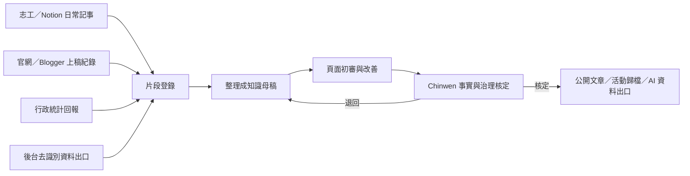

# 片段資料供應、整理與核定流程

## 用途與邊界

本流程把 Notion 日常記事、官網與 Blogger 上稿、行政統計及後台資料庫的片段，整理成可追溯的知識母稿、公開文章與未來 AI 資料出口。Chinwen 負責最後事實與治理核定。

本文件放在 `workbench/`，可從公開 Repo 查閱，但不出現在對外網站。它只描述分工與最小欄位，不保存個資、兒少資料、未公開案件、後台明細、合約、帳務、金鑰或內控細節。需要保密的原始片段留在 Notion、後台或其他權限控管系統。

文字替代說明：不同角色先在各自系統產生片段，經登錄、分類與整理形成知識母稿，再由頁面審核 Skill 初審；只有 Chinwen 核定後，才可成為公開文章、活動歸檔或 AI 資料出口。

## 角色分工

| 角色 | 主要工作 | 可決定 | 不可直接決定 |
|---|---|---|---|
| 志工 | 在 Notion 記錄日期、人物角色、事件、觀察與可用素材 | 提交片段、補充上下文 | 對外事實口徑與發布 |
| 內容編輯／寫手 | 將核定片段整理成文章、QA 或活動稿 | 敘事結構與可讀性建議 | 新增無來源事實或標示核定 |
| 官網／Blogger 上稿者 | 依核定稿填單上稿並回填網址、日期與版本 | 排版與發布作業 | 改寫重要數字、權利或服務條件 |
| 行政人員 | 回報期間、口徑、資料狀態與統計摘要 | 說明資料形成方式 | 將申請量、產能與交付量混為成果 |
| 後台資料維護者 | 提供去識別、具期間與版本的資料片段 | 技術匯出與更正紀錄 | 直接把正式資料庫交給公開 AI |
| 知識維護者 | 登錄、分類、去識別、關聯知識 ID 與提出修訂 | 送審狀態與影響範圍 | 最終事實與治理核定 |
| Chinwen | 最後核對事實、治理、權利與發布範圍 | `approved`、退回、撤回 | 法定組織另有專屬權責時不得取代法定程序 |

## 每個片段的最小欄位

- `fragment_id`：不重複的片段識別碼。
- `source_system`：Notion、官網、Blogger、行政回報或後台出口。
- `source_record`：原系統的頁面、表單或紀錄識別；公開版不可放私密網址。
- `event_date` 與 `captured_at`：事件發生與登錄時間。
- `contributor_role` 與 `content_type`：提供角色及記事、QA、統計、照片、活動或修訂類型。
- `summary` 與 `supported_claims`：片段摘要及它能支持的主張。
- `period`、`metric_definition`、`record_status`：統計片段必填，並說明是否已去重。
- `privacy_class`、`rights_status`、`public_scope`：個資、權利與可公開範圍。
- `status`、`reviewer`、`reviewed_at`：工作狀態與審查軌跡。

## 流程 Gate

1. **收件**：片段有來源系統、日期與提供者角色；缺欄位先退回補件。
2. **安全分類**：先移除個資、兒少識別、後台明細及不公開權利素材。
3. **事實整理**：將已知事實、推論、假設、待驗證與建議分開；不要求為早期歷史補造不存在的逐筆明細。
4. **內容分流**：長期事實進知識母稿；即時服務留在官網；活動素材套用活動歸檔模板；AI 只取得核定資料出口。
5. **頁面初審**：使用 `$review-green-miracle-public-content` 做角色任務、可讀性、引用、隱私與歸檔完整度檢查。
6. **Chinwen 核定**：確認事實、治理、權利及對外範圍；只有此步可改成 `approved`。
7. **發布與回寫**：記錄公開網址、版本與日期；變更或撤回時同步標記衍生內容。

## 例外、風險與維運

- 新聞或公開資料可證明歷程背景，但未直接指名綠色奇蹟時，不可推成直接證據。
- 2018 年前逐筆資料不完整，採公開史料與 Chinwen 核定脈絡；不為補數字而新增不可追溯明細。
- 同一事件在 Notion、官網與 Blogger 重複出現時，先建立共同事件 ID，再判斷是否去重。
- 官網當期條件可能比知識庫版本更新；服務型文章必須連回官網並設定較短審視週期。
- 若未來需要自動同步，先建立只讀、去識別、可版本化的資料出口，不讓 AI 直接讀寫正式後台。
